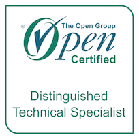
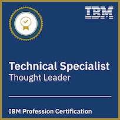
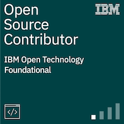
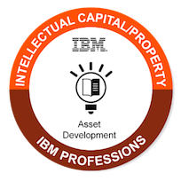
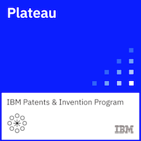
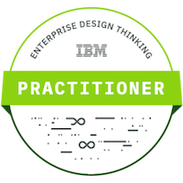
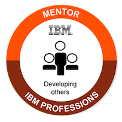

### Hi there!

My name is Mariusz, and I am a senior software engineer
in [IBM Research](https://www.research.ibm.com/) since 1997.
My research interests are system management and distributed,
scalable environments in Hybrid Cloud.
My current focus is security, identity, and secret management in Kubernetes environments.

I co-authored several technical papers and filed over [20 patents](https://patents.google.com/?inventor=Mariusz+Sabath).

Currently co-leading a white paper: ["Zero Trust using Cloud Native Platforms"](https://github.com/cncf/tag-security/issues/950) under CNCF Security TAG 

&#124;
[LinkedIn](https://www.linkedin.com/in/mariusz-sabath-b36b0b20/) &#124;
[Twitter](https://twitter.com/mrsabath) &#124;
[GitHub](https://github.com/mrsabath) &#124;
[My IBM Research page](https://researcher.watson.ibm.com/researcher/view.php?person=us-sabath) 
&#124;

-------

### My blogs and publications:

2022: 
* [NIST IR 8320B, "Hardware-Enabled Security: Policy-Based Governance in Trusted Container Platforms"](https://csrc.nist.gov/publications/detail/nistir/8320b/final)
* [Universal Workload Identity Blog](https://medium.com/universal-workload-identity)

2021:
* [Open source workload identity management could help secure hybrid clouds](https://research.ibm.com/blog/tornjak-project-cncf)
* [Deploying Tornjak with Helm Charts](https://medium.com/universal-workload-identity/deploying-tornjak-with-helm-charts-e51fc21b962c)

2020:
*  [Confidentiality and Governance of Cloud Services](https://www.ibm.com/blogs/research/2020/04/confidentiality-governance-cloud-services/)
*  [Protecting data using secret management with Trusted Service Identity](https://developer.ibm.com/articles/protecting-data-using-secret-management-trusted-service-identity/)
*  [IBM Research Launches Container-Based Open-Source Projects](https://www.tfir.io/ibm-research-launches-container-based-open-source-projects/?)
*  [Secret Management with Trusted Service Identity for Sensitive Data Protection](https://medium.com/@mrsabath/secret-management-with-trusted-service-identity-for-sensitive-data-protection-e511eb66d87f)
* 2016 [Building the IBM Containers cloud service](https://ieeexplore.ieee.org/document/7442607)
* 2010 [RC2—A Living Lab for Cloud Computing](https://www.usenix.org/biblio-6962)

### My Open-Source Projects and Community Contributions:
* [Tornjak](https://tornjak.io/)
* [Trusted Service Identity](https://github.com/IBM/trusted-service-identity/)
* [SPIFFE/SPIRE](https://github.com/spiffe/spire)
* [Tornjak Youtube Channel](https://www.youtube.com/@tornjak)

### Conferences:
* 2022 SPIFFE Community Day: ["Tornjak Journey - How to become a User Interface and a Control Plane for SPIRE"](https://spiffecommunityday-fall2022.splashthat.com), [rec]()
* 2021 Kubecon NA: ["Untangling the Multi-Cloud Identity and Access Problem With SPIFFE Tornjak"](https://kccncna2021.sched.com/event/a5e6781ddb6e4df01a5e52d5ae89b491), [rec](https://www.youtube.com/watch?v=Voy_8wifB0E)

### My Certificates:
* [Professional Certification: Level 3 - Distinguished Technical Specialist](https://www.credly.com/badges/7435c07b-6dfd-4bd4-aff8-b10cecb013c6/)
* [Technical Specialist Profession Certification - Level 3](https://www.credly.com/badges/b2e1bdda-ef6d-4ebd-a4a2-4d491e9339a1)
* [Open Source Contributor](https://www.credly.com/badges/442a9d8c-682e-4a59-9c2b-67f45ab514f3/public_url)
* [Patent Plateau](https://www.credly.com/badges/a9f5d07c-b2a5-4dcd-befe-74de7ea7060d)
* [All my certificates](https://www.credly.com/users/mariusz-sabath)

<!-- a href=""></a -->

### My Notes:
Useful [notes](https://github.com/mrsabath/mytechnotes/blob/master/README.md)

-------------------------------------------

I am using `hacker` [theme](https://pages-themes.github.io/hacker/) and the [editor on GitHub](https://github.com/mrsabath/mrsabath.github.io/edit/main/README.md) to maintain and preview the content of this file.

