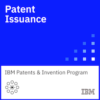

### Hi there!

I am a Senior Technical Staff Member in [IBM Research](https://www.research.ibm.com/) with over 27 years of experience in software engineering, specializing in distributed systems, cloud-native platforms, and open-source technologies. My focus is on establishing universal workload identity for secure multi-cloud and hybrid deployments, with a strong commitment to Zero Trust principles.

As a Senior Certified Level 3 (Thought Leader) Cloud Software Engineer, I design and develop large-scale, distributed cloud environments, primarily based on Kubernetes, Go, and Python, with a specialization in workload identity, secret management, and trusted identity frameworks to reduce attack surfaces and strengthen privacy and security across environments.

I currently lead architectural efforts aimed at improving security for AI Agentic Platforms ([Kagenti](http://kagenti.io)) project), combining workload attestation, token-based delegation, and centralized trust management to enable safe and autonomous AI operations.

Beyond my engineering work, I’m deeply engaged in the open-source community:

* Member of the [SPIFFE Steering Committee](https://github.com/spiffe/spiffe/blob/main/ssc/README.md)
* Active maintainer and contributor to several CNCF and open-source projects
* Advocate for open collaboration and secure, scalable design

I co-authored several technical papers and filed over [20 patents](https://patents.google.com/?inventor=Mariusz+Sabath).

&#124;
[LinkedIn](https://www.linkedin.com/in/mariusz-sabath-b36b0b20/) &#124;
[Twitter](https://twitter.com/mrsabath) &#124;
[GitHub](https://github.com/mrsabath) &#124;

-------

### My blogs and publications

2025:

* Blogs: [Kagenti — The Cloud Native Agentic Platform](https://medium.com/kagenti-the-agentic-platform)

2024:

* ["SPFFE/SPIRE on Red Hat OpenShift"](https://next.redhat.com/2024/06/27/spiffe-spire-on-red-hat-openshift/)
* ["Cross-cloud identity framework with SPIFFE/Spire on OpenShift"](https://developers.redhat.com/learning/learn:openshift:implement-cross-cloud-identity-framework-spiffespire-openshift/resource/resources:achieve-cross-cloud-identity-openshift-spire-and-tornjak)
* [CloudNative Security Conference NA 2024: “Demystifying and Enabling Worklaod Identity Across the Cloud Native Ecosystem”](https://cloudnativesecurityconna24.sched.com/event/1dCUU?iframe=no)
* [AHFE Conference: "Harnessing Growth-Mindedness to Enhance Organizational Effectiveness"](https://openaccess.cms-conferences.org/publications/book/978-1-964867-19-9/article/978-1-964867-19-9_3)

2022:

* [NIST IR 8320B, "Hardware-Enabled Security: Policy-Based Governance in Trusted Container Platforms"](https://csrc.nist.gov/publications/detail/nistir/8320b/final)
* [Universal Workload Identity Blog](https://medium.com/universal-workload-identity)

2021:

* [Open source workload identity management could help secure hybrid clouds](https://research.ibm.com/blog/tornjak-project-cncf)
* [Deploying Tornjak with Helm Charts](https://medium.com/universal-workload-identity/deploying-tornjak-with-helm-charts-e51fc21b962c)

2020:

* [Confidentiality and Governance of Cloud Services](https://www.ibm.com/blogs/research/2020/04/confidentiality-governance-cloud-services/)
* [Protecting data using secret management with Trusted Service Identity](https://developer.ibm.com/articles/protecting-data-using-secret-management-trusted-service-identity/)
* [IBM Research Launches Container-Based Open-Source Projects](https://www.tfir.io/ibm-research-launches-container-based-open-source-projects/?)
* [Secret Management with Trusted Service Identity for Sensitive Data Protection](https://medium.com/@mrsabath/secret-management-with-trusted-service-identity-for-sensitive-data-protection-e511eb66d87f)

2016 [Building the IBM Containers cloud service](https://ieeexplore.ieee.org/document/7442607)

2010 [RC2—A Living Lab for Cloud Computing](https://www.usenix.org/biblio-6962)

### My Open-Source Projects and Community Contributions

* Contributor and maintainer [Kagenti](http://kagenti.io/)
* Owner, contributor, and maintainer [Tornjak](https://tornjak.io/)
* Contributor and maintainer [SPIRE Helm Charts](https://github.com/spiffe/helm-charts-hardened)
* Owner and contributor [Trusted Service Identity](https://github.com/IBM/trusted-service-identity/)
* Contributor [SPIFFE/SPIRE](https://github.com/spiffe/spire)
* [Tornjak Youtube Channel](https://www.youtube.com/@tornjak)

### Conferences

* 2025 KubeCon + CloudNativeCon NA, Atlanta, GA: ["Tutorial: Build-a-Bot Workshop: Enabling Trusted Agents With SPIRE + MCP"](https://kccncna2025.sched.com/event/02ab3d1a41ed305278fa6b2309defaf6), [rec]()
* 2025 KubeCon + Colocated: ["Who Let the Agents Out? Securing AI Workloads the Right Way"](https://colocatedeventsna2025.sched.com/event/0a1cc2c3c88560659d77b4d46d9b6710), [rec]()
* 2025 Workload Identity by CyberArk / KubeCon + CloudNativeCon EU, London, UK: ["Zero-Trust Based Workload Identity Solutions For Agentic Platforms"](https://cyberark.wistia.com/medias/58yf3u8sxk)
* 2024 Workload Identity by Venafi / KubeCon + CloudNativeCon NA, Salt Lake City, UT "Federating Trust in the Cloud Multiverse with SPIRE and Tornjak"
* 2024 Applied Human Factors and Ergonomics (AHFE) Scientific Conf, Nice, France: ["Harnessing growth-mindedness to enhance organizational effectiveness"](https://ahfe.org/program.html), [rec]()
* 2024 CNCF CloudNative Security Con NA: [Workshop: "Demystifying and Enabling Workload Identity Across the Cloud Native Ecosystem"](https://sched.co/1dCUU),[rec]()
* 2023 CNCF CloudNative Security Con NA: [“Demystifying Zero-trust for Cloud Native Technologies”](https://sched.co/1FV1i), [rec](https://youtu.be/TJbw4mgILhM)
* 2022 SPIFFE Community Day: ["Tornjak Journey - How to become a User Interface and a Control Plane for SPIRE"](https://spiffecommunityday-fall2022.splashthat.com), [rec](https://youtu.be/4g8Oz7vT6bc)
* 2021 Kubecon NA: ["Untangling the Multi-Cloud Identity and Access Problem With SPIFFE Tornjak"](https://kccncna2021.sched.com/event/a5e6781ddb6e4df01a5e52d5ae89b491), [rec](https://www.youtube.com/watch?v=Voy_8wifB0E)

### My Certificates

* [Professional Certification: Level 3 - Distinguished Technical Specialist](https://www.credly.com/badges/7435c07b-6dfd-4bd4-aff8-b10cecb013c6/)
* [Technical Specialist Profession Certification - Level 3](https://www.credly.com/badges/b2e1bdda-ef6d-4ebd-a4a2-4d491e9339a1)
* [Open Source Contributor](https://www.credly.com/badges/442a9d8c-682e-4a59-9c2b-67f45ab514f3/public_url)
* [Seurity Zero Trust Principles](https://www.credly.com/badges/b529984a-9a09-4b5c-97fd-9fa76554c734/public_url)
* [Patent Plateau](https://www.credly.com/badges/a9f5d07c-b2a5-4dcd-befe-74de7ea7060d)
* [All my certificates](https://www.credly.com/users/mariusz-sabath)

<!-- Square -->

<!-- Round img size 350x350 -->
<!-- a href=""></a -->

### My Notes:
Useful [notes](https://github.com/mrsabath/mytechnotes/blob/master/README.md)

-------------------------------------------

I am using `hacker` [theme](https://pages-themes.github.io/hacker/) and the [editor on GitHub](https://github.com/mrsabath/mrsabath.github.io/edit/main/README.md) to maintain and preview the content of this file.

